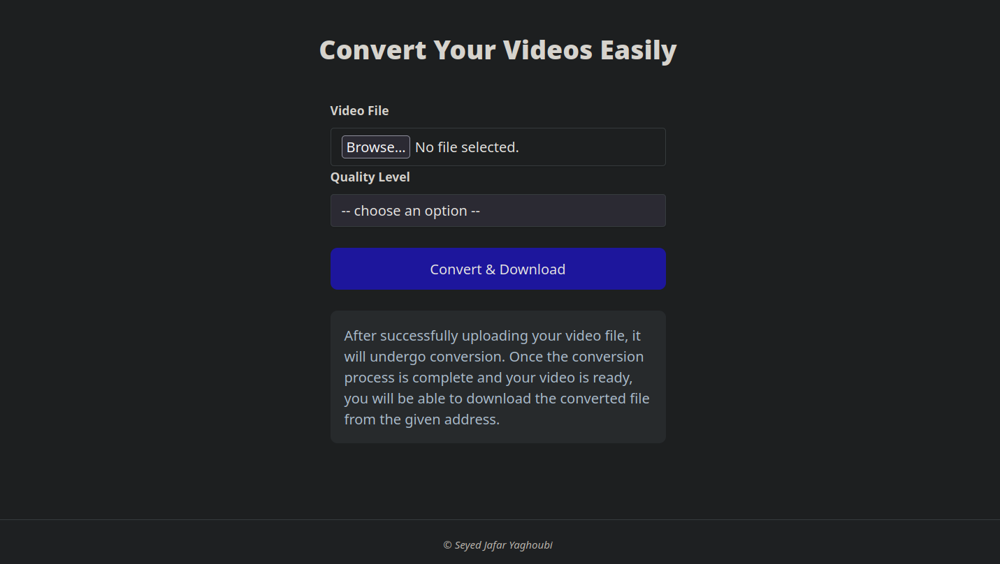

# Video Convertor

**Project README: Video Conversion Using Golang, Ffmpeg, and Gin Framework** 🎬


## Introduction
This project aims to demonstrate the process of converting a video file using Golang with Ffmpeg and the Gin web framework. By leveraging these technologies, users can upload a video file through a web interface, have it processed with Ffmpeg for conversion, and then download the new video file.

Please note 📌 that this is an educational project, so to deploy it in a production environment, you should finalize 🏁 the project and ensure it meets production standards.




## Getting Started
1. Ensure you have Golang and Ffmpeg installed on your system.
   
2. Clone the project repository:

    ```bash
    git clone git@github.com:J-Yaghoubi/VideoConvertor.git
    ```

3. Install the required dependencies using Go modules:


    ```bash
    go mod download
    ```

4. Run the application:

    ```bash
    go run main.go
    ```

5. Access the web interface at http://localhost:3000 to upload a video file and initiate the conversion process.


## Technologies Used
- Golang 🐹
- Ffmpeg 🎥
- Gin Framework 🌿
- Templ 🌐
- Htmx 💻


## License
This project is licensed under the MIT License (https://opensource.org/licenses/MIT).